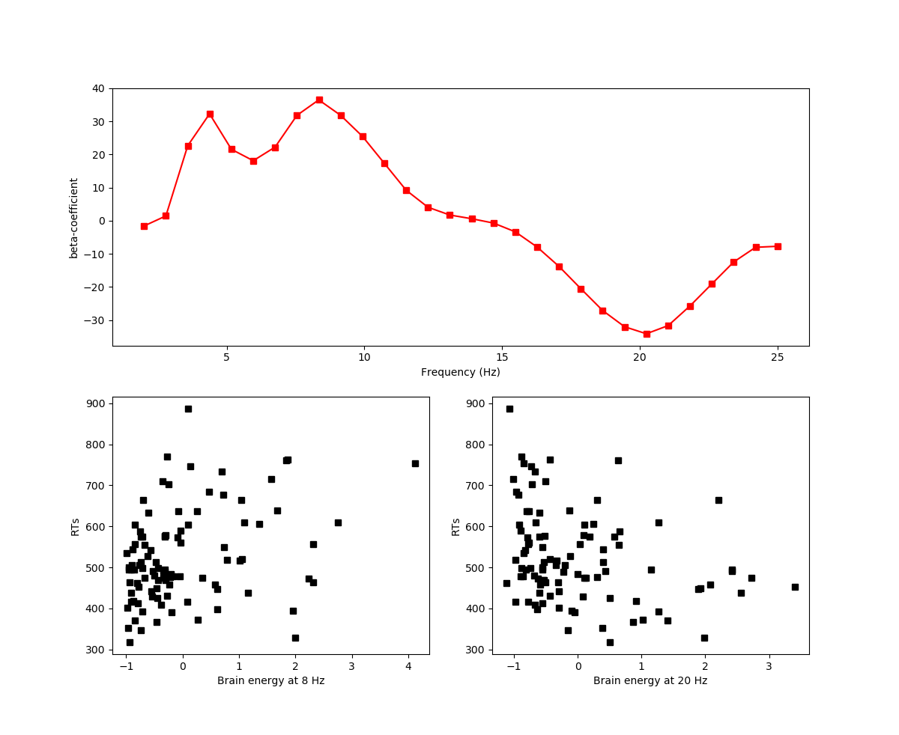

# Least-squares for model-fitting in statistics

Model fitting: 

Complex models simplified to simple understandle models


One of the methods of model fitting is using least squares method.

Steps involved in model fitting: 


Step-1: 

Let us consider the example of a model to compute height of a person.

Here the wights $\beta_{n}$ indicates which of the following has more influence on height.


Step-2: Mapping the data into the model equations.

Data


Model equations


Step-3: Matrix represenation


Step-4:  Compute the parameters


Step-5: Statistical evaluation of the model


Statistics terminology


---

## Linear least squares via left inverse

Finding $\beta$ or free parameters


Conditions for X to have a left inverse


**Is y in the column space of X ?**


The solution is exact when y belongs to column space of X. 
Otherwise that is the closest to y that is in the column space.


Here $\epsilon$ is nothing but the projection of y on X


## Least square via orthogonal projections 

Here in this example lets us consider we get data from a large pharmaceuticals about patient studies, we need to study this data.


Projections in $R^2$


Projections in $R^N$


using statistical equation this is represented as:


Now the complete geometrical representation of this can be seen as : 


---
## Least-squares via row reduced echelon form (RREF)

Computing inverse by RREF 


Using the augmenting X y will not work because the resulted will not be a Identity matrix but as shown in the figure.


The solution is : 
LS and normal equations


now this is how the augmented matix and the result looks like : 


Why this procedure works ? 


## Model predicted values and residuals

$\epsilon$ and $y\hat{}$ are orthogonal


There for $\epsilon=y\hat{} - y$


Some times $\epsilon$ is also know as residual matrix

We can re-write the above equatio as : $||\epsilon||^2 = ||X\beta - y ||^2$. i.e magnitude of $\epsilon$  is equal to  magnitude of the difference of the predicted data($X\beta$) and the observed data($y$).

The goal of this now is to find $\beta$ (other terms cannot be changed) which minimizes this equation. Hence it is called Least squares equation:


## Least squares application

Application 1:

### The average of a set of numbers can be formulated as a least squares problem

We know following are the steps involved in model fitting


Step1: 


Step2: 


Step3:


Step4: 

```python
# design matrix
X = np.concatenate( [np.ones([N,1]),np.array([np.arange(0,N)]).T],axis=1) ## Adding intercept term to the design matrix
# fit the model
b = np.linalg.solve(X.T@X,X.T@data)

# compute the model-predicted values
yHat = X@b

# plot data and model prediction
plt.plot(np.arange(1,N+1),data,'bs-',label='Data')
plt.plot(np.arange(1,N+1),yHat,'ro--',label='Model pred.')

plt.legend()
plt.show()
```

Application 2:

### Least squares in real data from a neuroscience experiment


in the below experiment the candidate was asked to click the mouse button when a signal was given. Below shows the response data of the candidate for around 100 iterations.


EEG contains singals. The components of these signals are extracted using fourier transform. 


In our application we need to find if there is any corelation between the response times to the data extracted from the EEG signals.

Modeling Steps:

Step1: Equation of the underlying model


Step2: Model equations 

Formalize in head.

Step3 : Convert equations in to a matrix-vector equation 

It is important to look the size of the matrices. In this case not all data points have a previous trail response for the first trail.
Hence the matrix is made 98 rows instead of 99 trails.


Step4 : Compute the parameters 

code: 3_LSApplication2.py

Input data: 

Responses :


EEG Data:


Output : 

Spectrum of beta coefficients  and scatter plots for 2 frequencies 8 and 20 Hz




---

## Least Square via QR decomposition


