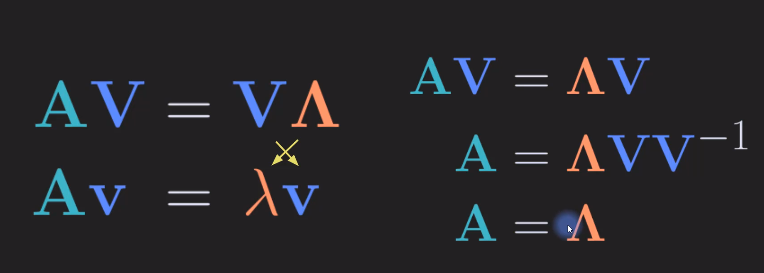
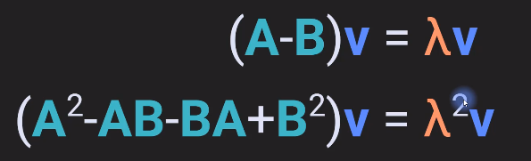

# Eigen Decomposition

Also known as Eigen value decomposition and Eigne vector decomposition

## Eigen Values and Eigen Vectors

Eigen decomposition is only for square matrix

Eigen value and Eigen vectors are always in pairs

### Geometric interpretation of eigen vectors/values

We know that multiplying a matrix with a vector results in a vector which is scaled and rotated.

However, there are some exceptions i.e there are some matrix vector pairs that result after multiplying in a vector that is in the same space.

Which mean multiplying a vector $v$ by $A$ is equivalent to multiplying the vector by a scalar ($\lambda$) 
i.e, $\lambda v = Av$ 

When this condition is satisfied, 
The ($\lambda$) associated with $A$ is called the **Eigen value** and the vector $v$ is called the **Eigen Vector**

Example :
 
Below image shows the data of people going to a pizza place and a gym which are close to each other on different days.

In this data, we see that the relation is negative, i.e when people go to gym they are less likely to go to the pizza place.

The basis vector or axis of this data is the red line.
If we would represent these data using something called a covariance matrix which is a matrix that shows the correlations across all the variables in a data set then the eigendecomposition of that matrix would reveal that this is an eigenvector(red line) and the relative length of this line is related to the Associated eigenvalues so this dataset is an R2 which means that the corresponding covariance matrix would be two by two. And that means we would have two eigenvectors and two eigenvalues. So the second eigenvector would point in this direction and its associated eigenvalues would be smaller because there is less variance in this direction. There's more variance in this direction(along redline) So larger eigenvalues. less variance in this direction(Yellow line),So smaller eigenvalue. In statistics, This procedure is called a principal components analysis or PCA, because we are finding the principal axes of covariance between the variables. So PCA is nothing but the eigendecomposition

## Finding eigen values

$(A-\lambdaI)v=0$ This means that the vector v, which is the eigen vector, is in the null space of the matrix A, when A is shifted by $-\lambda$.

What if a matrix has a non-trivial null space?

It's not just the empty set for null space.
It means that this is a singular matrix because the null space of a full rank square matrix is the empty set.

So if a minus lambda times the identity were full rank, then this equation would be true only if V is a vector of all zeros. But we ignore that case because it's trivial and it's uninteresting.

So we assume that V must contain at least one non-zero element. So V is not the trivial null vector. 

We also know that the determinant of a singular matrix is zero.

Now, $|A-\lambdaI|=0$ and if we know (n-1)) values of a matrix and we know the determinant,then it is possible to solve for the remaining unknown value.  This is how we can solve for $\lambda$

This equation $|A-\lambdaI|=0$ is called the **charcteristic equation**. Solving this will give us the roots of the equations that is nothing but the eigen values.

Example : 

Example 2 :

Nth order equation has N roots i.e. a NxN matrix has N eigen values

### Short-cut for finding eigen values for 2x2 matrices

That is nothing but :

> Eigen values of Traigonal and Diagonal matrices are its diagonal elements 

---
## Eigen Vectors 

Eigen vectors reveal important directions in a matrix

Eigenvectors are encrypted inside the Matrix. They are locked inside the Matrix.Each eigenvalue is like the decryption key for its corresponding eigenvector. Once you have the key, the eigenvalue, you slot it into the Matrix,turn it and the eigenvector is revealed.

Formal representation: 

Example:

Step1: 
Find eigen values 

Step2: 

For $\lambda=3$

For $\lambda=-1$

The Eigen vectors are : 

We might also arrive at these values solving the above equations : 

Does that mean these are different eigen vector for the matrix A?
Looking at it geometrically, we can see that it lies on the same Basis vector, the other solution such as [-3 3] or [$\pi$ $-\pi$] and soon can also be eigen vector basically on the same basis vector.

### Eigendecomposition by hand

Example 1: 

$\lambda=2$

$\lambda=7$

Eigen values ad Eigen vectors of A

Example 2:

Here one of the eigen values is zero and that mean the matrix is a singular matrix.

$\lambda=0$

$\lambda=11$

$\lambda=-1$

Eigen values ad Eigen vectors of A

---
## Diagonalization

This formulation also provides a novel conceptual insight into one of the core ideas of Eigen decomposition, which is finding a set of basis vectors v such that the original Matrix A is diagonal in that basis space.

### Matrix powers via diagonalization

Is fairly easier to compute the square of a 2x2 matrix on pen and paper.

What about the below example:

We know by diagonal matrix multiplication: 

Benefiting from this property

Example : 

---

## Matrix powers and eigendecomposition

This holds good for any value of power. i.e For a matrix $K$ , its eigen vectors does not change for $K^n$, and its eigen values are $\lambda^n$

## Eigen decomposition of matrix differences

---

## Eigen vector distinct eigenvalues

Distinct eigen values gives distinct eigen vectors 

Proof:

## Eigenvectors of repeated eigenvalues

Example: 

Here V1 and V2 are the same , we cannot have a different value in this case 

Example 2: 

In this case the eigen vectors are different for same Eigen values 

Geometrically 

## Symmetric matrices have orthogonal eigenvectors 

Proof: 

Here from the last equation the first term cannot be zero because of our assumption. Hence V1 and V2 are orthogonal

Example: 

Here we can see that v1 and v2 are othogonal 

### Implications of Eigen vectors being orthogonal

We get a diagonal matrix when we multiply V.T and V. After normalizing we get an Identity Matrix.

Therefore: 

## Reconstruct Matrix from Eigen layers

## Eigen decomposition of Singular matrices

Calculating the eigen values of a singular matrix is easier than computing it for Full-ranked matrix, because for a singular matrix atleast one of the eigen value is 0.

Example: 

Why do singular matrices have eigenvalue 0 ? 

## Generalized Eigen decomposition 

The following is the better way to compute it

