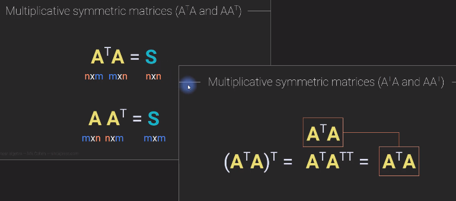
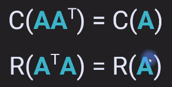
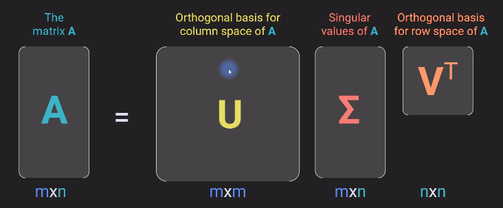
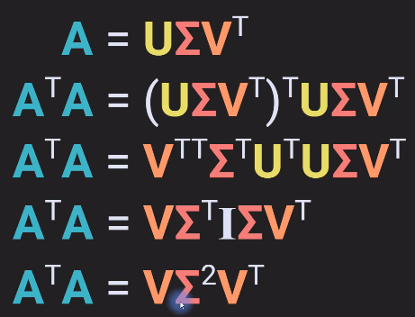
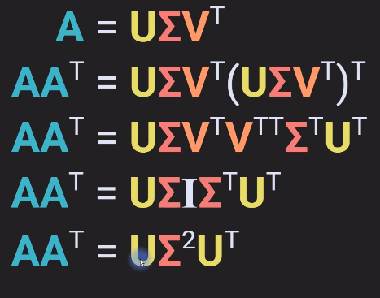
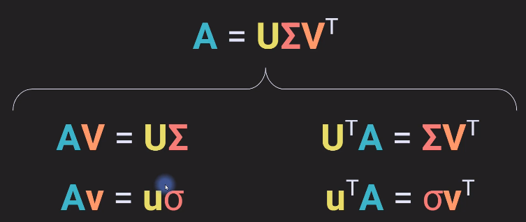
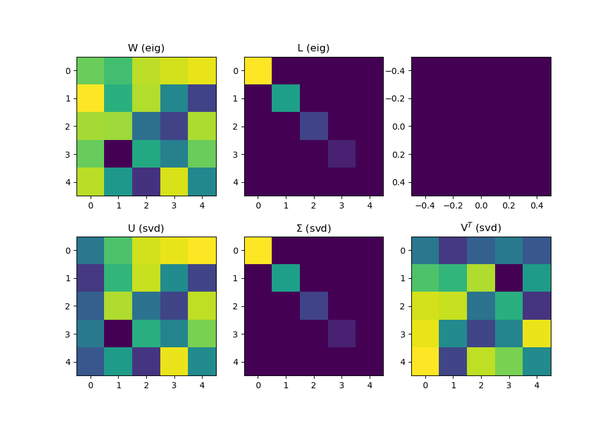
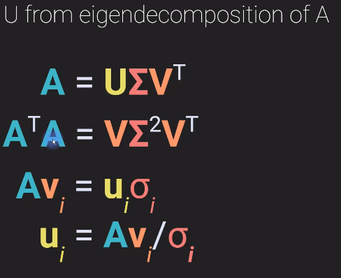
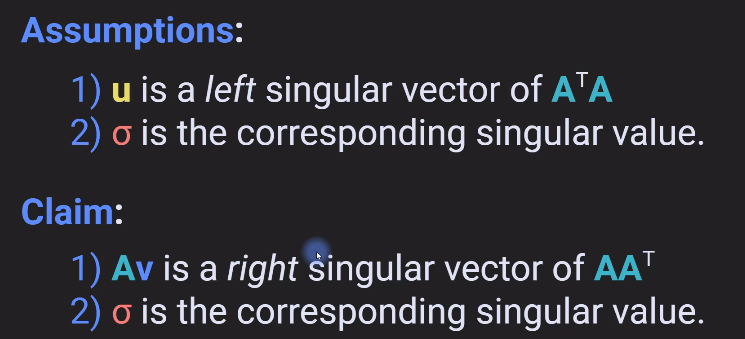
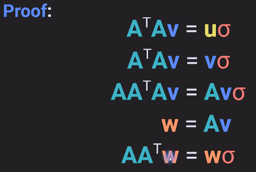

# Singular value decomposition

Remainder:

Multiplicative and additive symmetric matrices



Row and Column space relation



## SVD: Overview



**SVD : Computation**



Computing for U





The last equation looks similar to the eigen value equation, except that here $v$ is a right singular vector and $\sigma$ is a left singular vector 

> SVD is applicable to any sized matrix and not only the squared matrix as in eigen decomposition.

## For Symmetric matrix SVD and Eigen decomposition is same 




- W = U are the same except that there might be sign flips in some rows.
- U and V are same 

## Relation between singular values and eigenvalues

- $\lambda=\sigma$  for $A'A$
- $\lambda$ of $A'A$ = $\sigma$ of $A$
- For a non symmetric value they may not be equal

```html
case 1: eig(A'A) vs. svd(A)
Eigen Value:  [ 0.          0.34314575 11.65685425]
Sigma in SVD:  [ 0.34314575 11.65685425]
===============================
case 2: eig(A'A) vs. svd(A'A)
Eigen Value:  [ 0.          0.34314575 11.65685425]
Sigma in SVD:  [ 0.          0.34314575 11.65685425]
===============================
case 3a: eig(A) vs. svd(A), real-valued eigs
Eigen Value:  [0.58578644 1.         3.41421356]
Sigma in SVD:  [0.49384652 1.10038368 3.68039011]
===============================
case 3b: eig(A) vs. svd(A), complex eigs
Eigen Value:  [-1.5086462 +0.j          0.29716944-1.12916912j  0.29716944+1.12916912j]
Sigma in SVD:  [0.4463902  1.79584974 2.56569228]
```

## U from eigendecomposition of A




## Claim and proof

**Av is a right singular vector of $AA^T$**

**$\sigma$ is the corresponding singular value** 



Proof: 



implementation 5_***.py