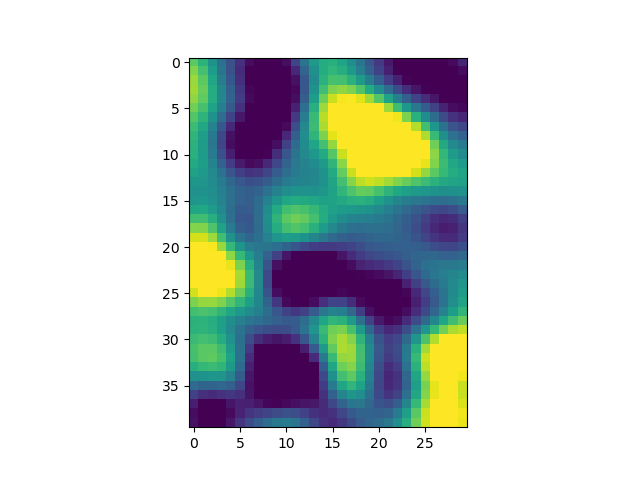

# Singular value decomposition

Remainder:

Multiplicative and additive symmetric matrices


Row and Column space relation


## SVD: Overview


**SVD : Computation**


Computing for U


The last equation looks similar to the eigen value equation, except that here $v$ is a right singular vector and $\sigma$ is a left singular vector 

> SVD is applicable to any sized matrix and not only the squared matrix as in eigen decomposition.

## For Symmetric matrix SVD and Eigen decomposition is same 


- W = U are the same except that there might be sign flips in some rows.
- U and V are same 

## Relation between singular values and eigenvalues

- $\lambda=\sigma$  for $A'A$
- $\lambda$ of $A'A$ = $\sigma$ of $A$
- For a non symmetric value they may not be equal

```html
case 1: eig(A'A) vs. svd(A)
Eigen Value:  [ 0.          0.34314575 11.65685425]
Sigma in SVD:  [ 0.34314575 11.65685425]
===============================
case 2: eig(A'A) vs. svd(A'A)
Eigen Value:  [ 0.          0.34314575 11.65685425]
Sigma in SVD:  [ 0.          0.34314575 11.65685425]
===============================
case 3a: eig(A) vs. svd(A), real-valued eigs
Eigen Value:  [0.58578644 1.         3.41421356]
Sigma in SVD:  [0.49384652 1.10038368 3.68039011]
===============================
case 3b: eig(A) vs. svd(A), complex eigs
Eigen Value:  [-1.5086462 +0.j          0.29716944-1.12916912j  0.29716944+1.12916912j]
Sigma in SVD:  [0.4463902  1.79584974 2.56569228]
```

## U from eigendecomposition of A


## Claim and proof

**Av is a right singular vector of $AA^T$**

**$\sigma$ is the corresponding singular value** 


Proof: 


implementation 5_***.py

---

## SVD and Four spaces.

 We know the four sub spaces:
- the column space 
- the row space 
- the null space and 
- the left null space.

One of the features of SVD is that it provides orthogonal bases vectors for each of these four spaces.


- The Matrix U provides the Orthogonal basis for Column space of A. Matrix U is also known as 'Left singular matrix'
- The Matrix $V^T$ provides the Orthogonal basis for row space of A. Matrix $V^T$ is also known as 'Right singular matrix'
- $\Sigma$ gives singular values of A. The number of non zero singular values of A = rank(A). In this case one of the singular value is zeros hence it is said to be in the null space of (A)

    

    If we transpose matrix A, now the matrices look like : 

    

    and $\Sigma$ in this case would be: 

    

Here we can see all the four subspaces : 


## Spectral theory of Matrices

The idea of spectral theory is to represent the complex systems into sum of simple systems.

In case of Matrix, we know the layer perspective


Similarly for SVD, we can get a lot of details about A.

Multiplying single column of U and respective row of V.T gives us a layer of A i.e a rank(1) matrix of A. This matrix only has direction and no magnitude. The importance of this layer comes from multiplying that rank(1) matrix by the corresponding singular value.

Here is an example implemented in 6_SpectralTheoryOfMatrices.py

Original Matrix (A)


First row of images showing the multiplication of single column of U and single row of V.T and the corresponding singular vector

Second row of images lows the formation of A , by adding these individual rank 1 matrices.


## SVD for low rank approximations

Again taking the layers-perspective


If the layer containing the triangle is removed we get the following result 


The above image is not the exact same image as a complete matrix. Even though 25% of the data is removed we can get the close apporiximation of the original matrix.

This example illustrate the basic concept, which is that we want to approximate the Matrix by using a small number of components in order to reduce the total amount of data without really reducing the amount of information in the Matrix.

Key idea of a low-rank approximations is : 


How to find the balance between compression and information loss?

It depends on many factors. And the answer tends to be very application specific, which is to say in some domains we're more willing to lose information to really reduce data.
For example, putting a JPEG on the Internet, whereas there are other situations where you're willing to tolerate a larger data set in order to avoid reducing too much information.

How can we compress data in a matrix? 


Here just by taking he first K(number of singular values) columns of U and first K rows of V.T we can get back a low rank approximation of A.


Example : 
Here A=40x30 matrix created with 5 compoenents and the difference between the two.


## Convert singular values to percent variance

Interpreting singular values: 

Here in the below example , we can see that when we multiply Matrix A by a scalar ($\Psi$) , the resulting SVD will be the same in the sense U and V are not changed and singular values are multiples of the scalar.


Example : 


The concept of spectral theory: 


Here we see that  $u_i$ and ${v_i}^T$ are rank 1 matrices and they do not have a magnitude, they only have direction. We need to multiply it by singular values to give the magnitude.

i.e The sum of all the singular values tell the total information in matrix A.

In other words, The sum of all the singular values is the total amount of variance in matrix A and any one singular value can be evaluated according to how much it contributes to the sum total of all the variance in Matrix A.

### Normalizing singular values


The last step is optional, it will convert into percentage.

Question:

> Consider a 4x4 random matrix (matrix A) with singular values 1, 2, 3, and 4. You apply the Gram-Schmidt procedure to that matrix and call it Q. What are the singular values of Q?

Answer: 
> 1,1,1 and 1 becasue the Q matrix is orthogonal.
> All orthogonal matrices have singular values of 1's. To see why, recall that (1) Q'Q=I, (2) all eigenvalues of I are 1, and (3) singular values are squared eigenvalues of Q'Q.

## Matrix Inverse and Pseudo Inverse

Regular inverse: 


This leaves us only with finding the inverse of $\Sigma$. We know that the inverse of diagonal matrix is:


This is only true if when the singular values are non-zero.


Pseudo Inverse(Moore-Penrose Pseudo Inverse): 


The pseudo inverse of the diagonal matrix is similar to the normal inverse expect that we do not take the reciprocal of a zero element on the diagonal.


## Condition number of a Matrix 

The condition number of a matrix is used to indicate the spread of the information in a matrix. The conidition number is defined as the ratio of the largest singular value to the smallest singular value. 


If we think of a matrix as representing some kind of geometric shape, then the condition number is the ratio of the narrowest to the thickest spreads in that shape.

Example:


