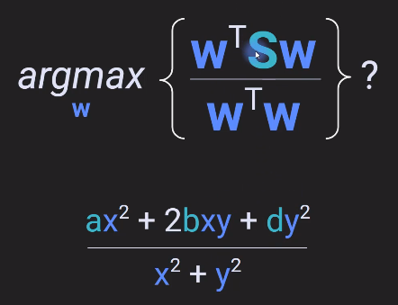

# Quadratic Form and Definiteness

## Algebraic perspective

Example:

interpretation: The result 9 is the energy of the matrix S at co-ordinated [3 -1]

General form : 

What if we have one matrix and many vectors: 

The rate at which the terms $x^2$ and $y^2$ goes to $\infty$ is different from the term $xy$ going to $\infty$ .

For a Symmetric matrix S 

The Transpose of a quatratic form of a symmetric matrix is the same quadratic form.

In this case the equation becomes: 

Quadratic form of a Identiy matrix: 

For a 3X3 matrix: 

## Geometric perspective

Quadratic form can be represented as function of Matrix S and vector w as : $f(S,w)=w^TSw=\epsilon$

for number of different w's we  get a surface.

Examples of surfaces for different S.

The signs of these energy landscapes are related to what is called the definiteness of the matrix.

## Normalized Quadratic form

Non-normalized

In the above figure we can see that the energy of S increases in all directions as x and y increases to infinity.

Normalized
To get the normalized form

## Eigen vectors and the quadratic form surfaces

The eigenvector associated with the larger eigenvalue points in the direction along the **ridge** and the eigenvector associated with these smaller eigenvalue points along the direction of the **valley**.

### Application of normalized quadratic form : PCA

PCA: Principle component analysis

Here $AA^T$ is the covariance matrix.

The goal of principal components analysis is to find a linear weighted combination of all the channels such that the linear combination maximizes the covariance of the data set.

How to find the weights ? 

This is the eigenvalue equation in matrix form. So that means that finding the solution to the problem of the vector that maximizes the normalized quadratic form of a covariance matrix is exactly the Eigen vectors of that matrix.

## Quadratic form of generalized eigen decomposition

This is same as below with introduction of a identity matrix.

Now instead of I we can introduct R .

Here the assumption is that both S and R are symmetric matrices.

We know from GED is that the eigenvectors matrix of a GED is not an orthogonal matrix. However introducting R we can make it identity matrix.
i.e 

---
## Matrix definiteness

Definiteness refers to the sign of its energy landscape.

Characteristics of definiteness 

### Proof : A^T A is always positive (semi) definite

A transpose A is always positive semi definite or semi definite.

- $A^TA$ is positive definite when A transpose A is invertible, meaning full rank 
- it is positive semi definite when A transpose A is reduced rank or non-invertible or singular.

This is also true for $AA^T$

Not all symmeteric matrices are positive (semi) definite.

## Proof: Eigenvalues and matrix definiteness

