# Matrix Multiplication

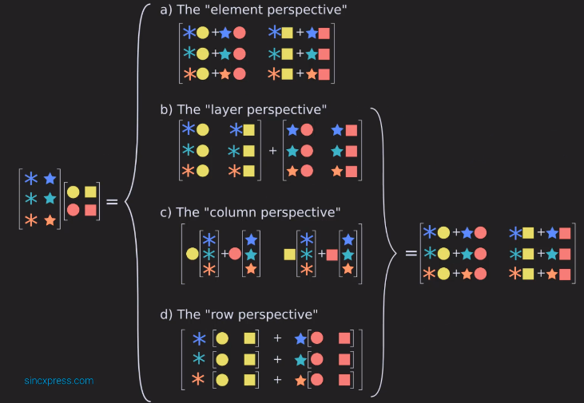

## Element perspective

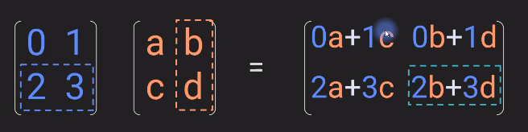

## Layer perspective

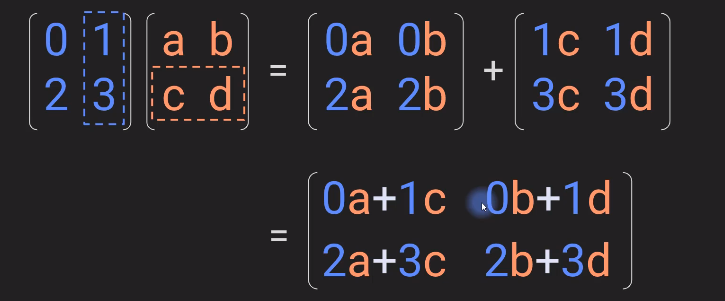


## Column perspective

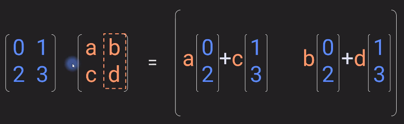

## Row perspective

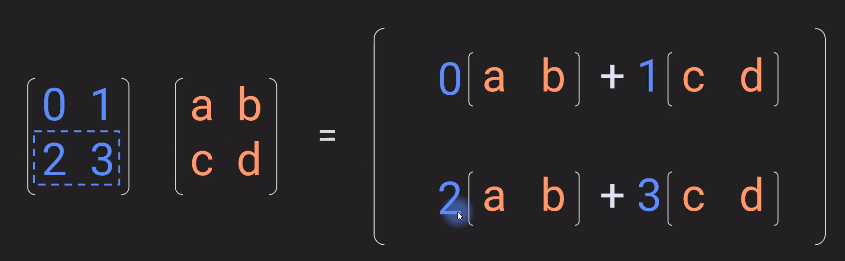

---

# Order of Operation

LIVE EVIL rule: simply means that when multiplying matrices and then transposing is equal to taking transpose of individual matrices and then multiplying.


Example

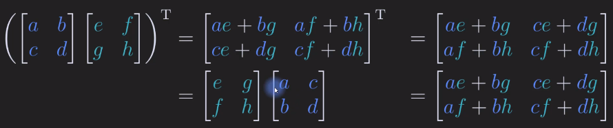

# Matrix vector multiplication

Graphical representation

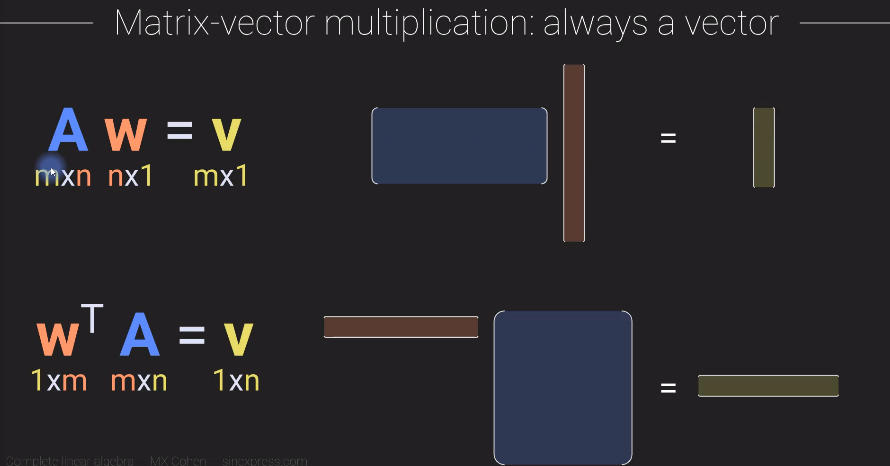

## Matrix vector multiplication with Symmetric and Non-Symmetric

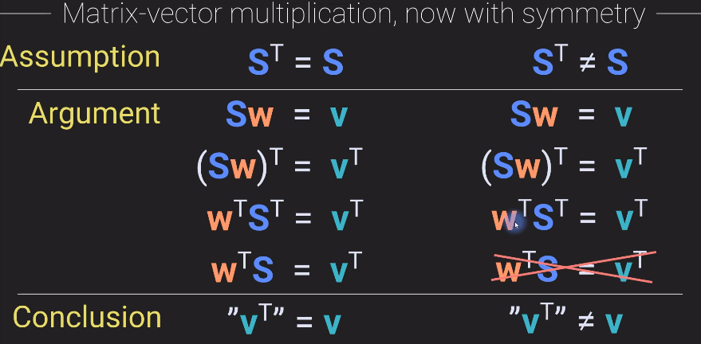

---
# Matrix 2D Transformation

Multiplying a vector with a matrix: 
The vector will be rotated and scaled.

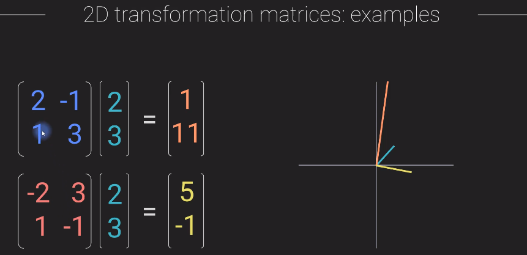

Pure rotation matrix just rotates the vector but does not scale.

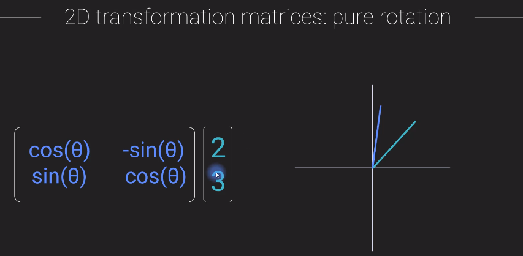


Here in the below example it is a case where a matrix multiplication just scales the vector and does not roate.
In this example the scaling is 4 times and hence it is similar to multiplying a vector by a scalar

Such vectors are called Eigen vector of the matrix and scalar as Eigen value of the matrix.

This can be represented by Eigen value Equation **Av = l v**

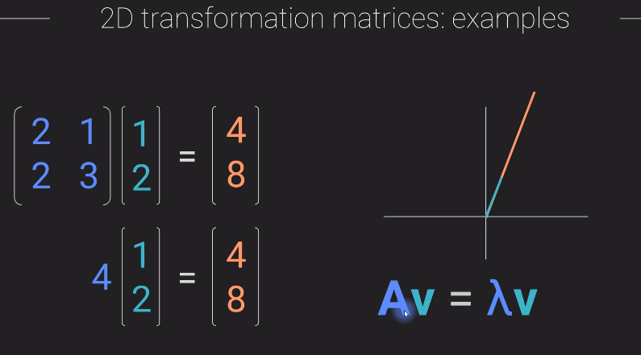

---
# Additive and Multiplicative Identity Matrix


Additive Identity Matrix is a zero matrix
Multiplicative Identiy Matrix is a Identity(eye) matrix

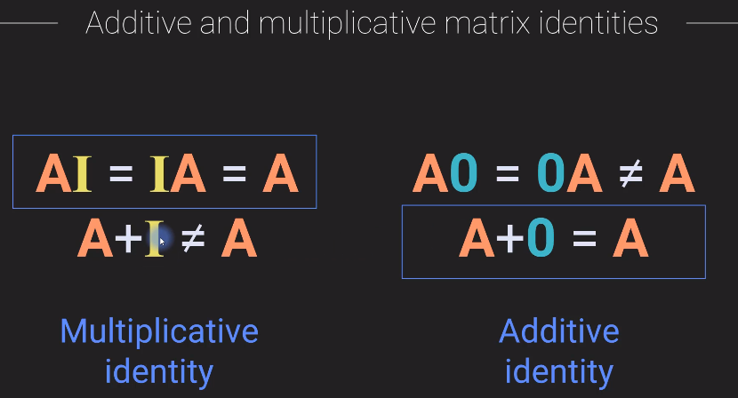

---
# Additive and Multiplicative Symmetric Matrix

Creating symmetric matrix from non symmetric matrix.
1. Additive Symmetric Matrix Creation

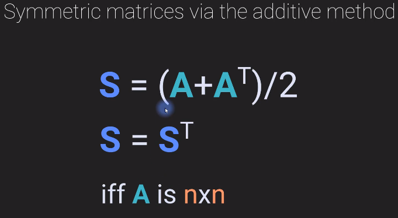

Example:

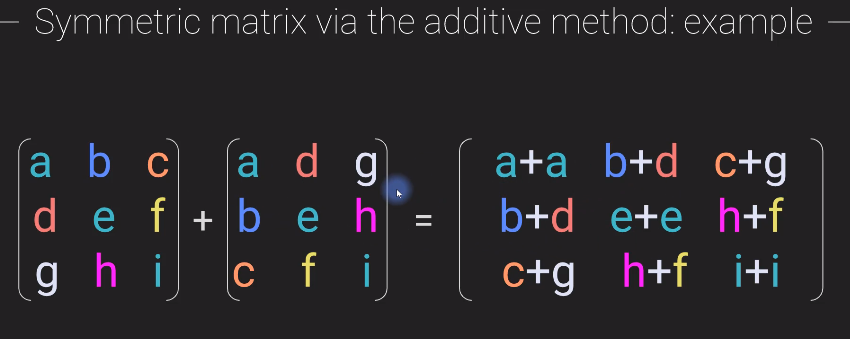

This does not work if the matrix is not square.

2. Multiplicative  Symmetric Matrix

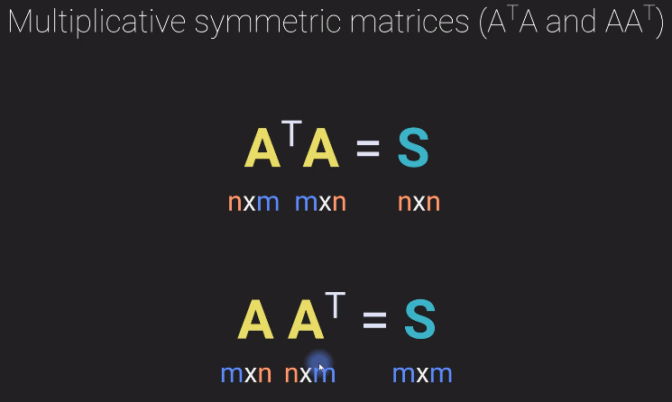

This will always give a symmetric Matrix irrespective of it is a sqaure or a rectangular matrix.

Proof-1: Here it is showing A A.T is symmetric by taking its transponse and arriving again at A A.T

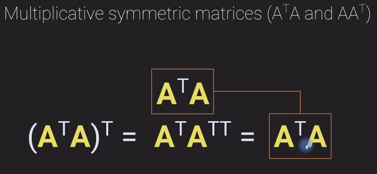


Proof-2:

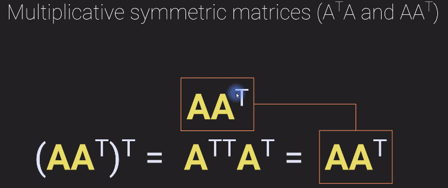

Example: 
Getting a symmetric square matric from a non symmetric rectangular matrix

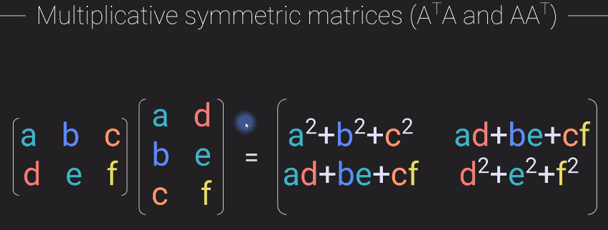

## Application of Multiplicative Symmetry

This method is used Statistics and signal processing.
To find the variances and co-variances.
The Diagonal elements gives the variances and the off-diagonal elements give the co-variances .

## Matrix multiplication of two Symmetric matrices

Matrix multiplication of two symmetric matrices are not symmetric. This can be made symmetric with a constraint as shown below.

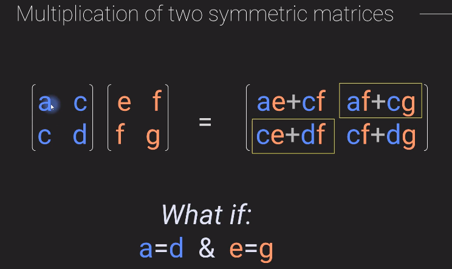

Example:

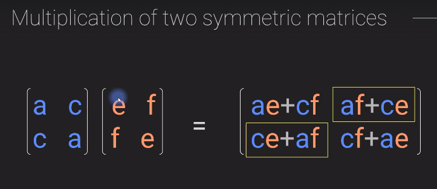

> This is only true for 2x2 matrix

In general **Multiplication of two Symmetric matrices is not symmetric**

---
## Fourier Transform via Matrix Multiplication


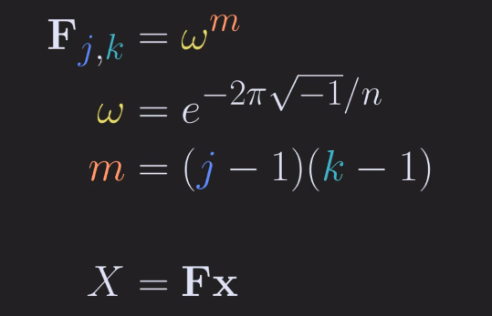

Not a efficient way of creating Fourier transform. Fast fourier transform is.

---

## Frobenius dot product

Vectorization of Matrix:

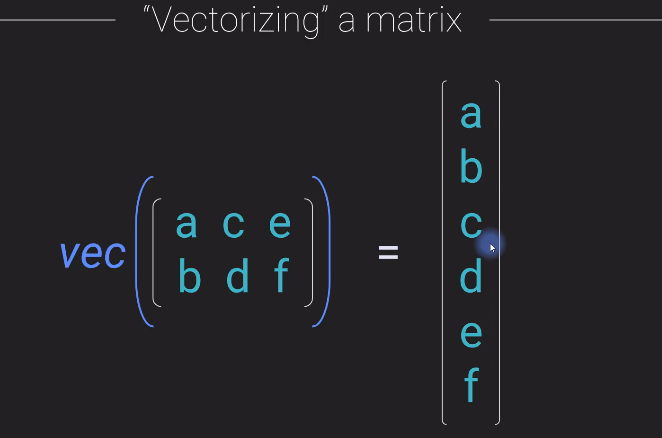

Different methods of computing Frobenius product
Method-1: 

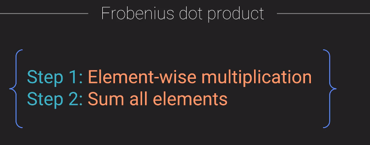

Method-2: 

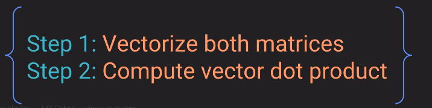

Method-3: 
Using trace of the matrix:

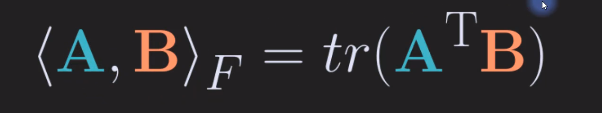

Heres the trick

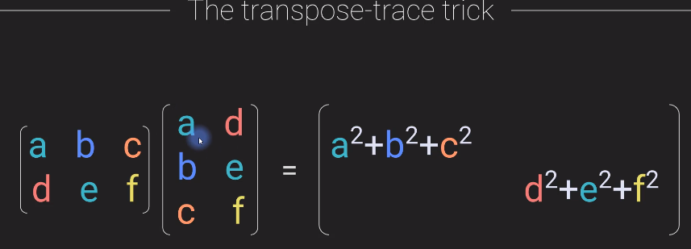

Frobenius Norm or Norm of a matrix is computed as:


---

## Matrix norms

There are many number of matrix norms. Some of the main ones are:

1. Forbenius norm

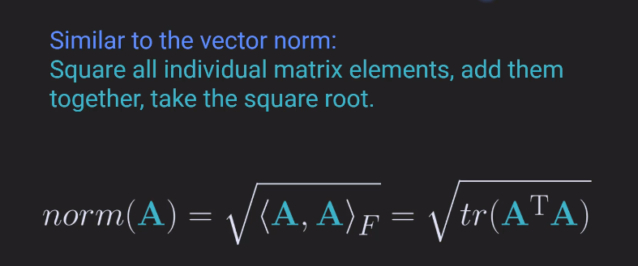

2. Induced Norm

Here x =2

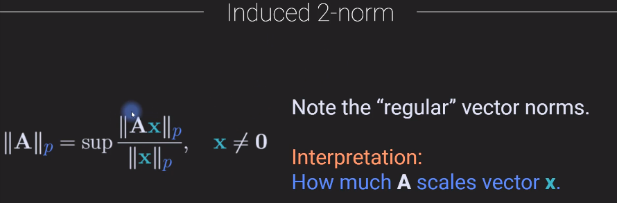

3. Schatten p-norm

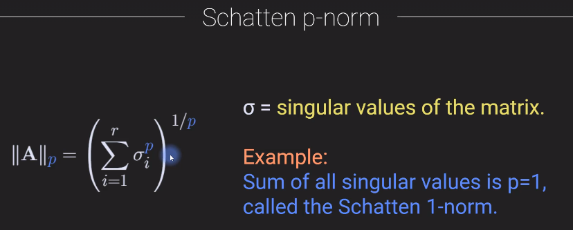

Example:

```python
import numpy as np

# Create a matrix
A = np.array([ [1,2,3], [4,5,6], [7,7,9] ])

# optional orthogonal matrix to show that 2-norm is 1
Q,R = np.linalg.qr(np.random.randn(5,5))
# A = Q

# Frobenius norm
normFrob = np.linalg.norm(A,'fro')

# induced 2-norm
normInd2 = np.linalg.norm(A,2)
# note: computed as below
lamb = np.sqrt( np.max(np.linalg.eig(A.T@A)[0]) )

# schatten p-norm
p = 2
s = np.linalg.svd(A)[1] # get singular values
normSchat = np.sum(s**p)**(1/p)

```
Output: We can see that each of them comput norm which are nearly equal
```bash
Frobenius norm:  16.431676725154983 

Schatten p-norm:  16.431676725154986 

Inuced 2-norm:  16.392007827749776 
```

---
## Conditions and proof of self-adjoint operator

inside <> angle brackets means dot product.
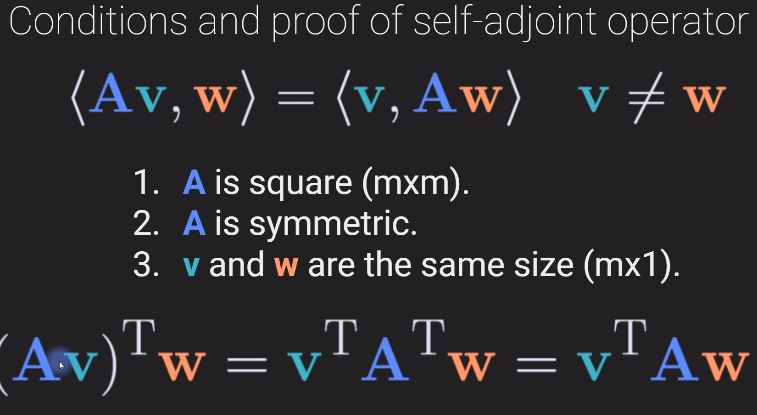

---

## Matrix Division

1. Element-wise division 
with the constraint that the second matrix has no 0 element in it.

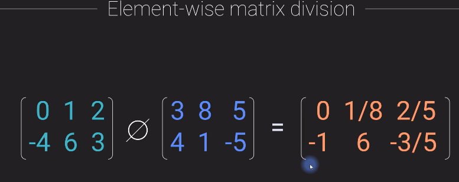

2. Inverse
This is not exactly division and not all matrices will have an iverse


