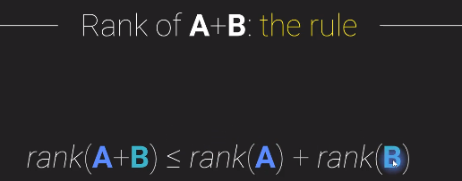
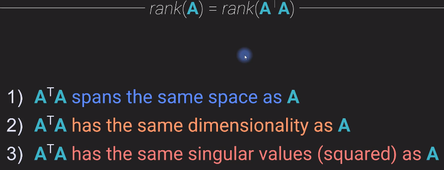

# Matrix Rank

Definition:
> The rank of a matrix is defined as (a) the maximum number of linearly independent column vectors in the matrix or (b) the maximum number of linearly independent row vectors in the matrix. Both definitions are equivalent. For an r x c matrix, If r is less than c, then the maximum rank of the matrix is r.

Properties of the rank of a matrix:

1. Rank of a matrix **r** or **rank(A)** is a non-negative integer.

2. Maximum possible rank is max(r) = min(m,n). Where m,n represents the matrix dimension

3. Rank is property of whole Matrix.

4. Terminology

If the rank of the matrix is certain value, then the matrix can be called as below:

5. Rank corresponds to the dimensionality of information.

6. One definition of rank: 

> The rank of a matrix is the largest number of colummns (or rows) that can form a **linearly independent set** .

Example in the above image: Matrix A has rank 2, because two of the columns can form a linearly independent set.

---

## Computing Rank

Methods to comput rank :

1. Count the number of columns in a linearly independent set.
2. Apply row reduction to reduce matrix to echelon for, and count the number of pivots.
3. Compute the singular value decomposition(SVD) and count the number of non-zero singular values.
4. Compute the eigen decomposition and count the number of non-zero eigen values.

Difficulties in computing rank:

## Limits of rank of Added and Multiplied Matrices

Rank of added matrices: 

Rank of multiplied matrices:

---

## Rank of A^TA and AA^T

Here are 3 explaination of the above property: 

Explaination 1 : 

Explaination 2: 

Using Null matrix

Explaination 3:

Using SVD, Single value decomposition

Implications of this : 

We always get a full, squared symmetrical matrix.

## Making a matrix full rank by shifting

Example 

