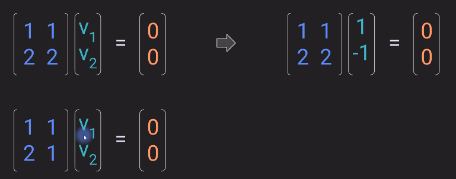
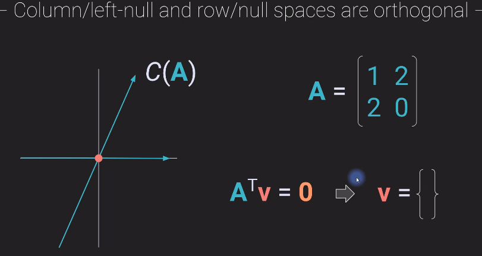
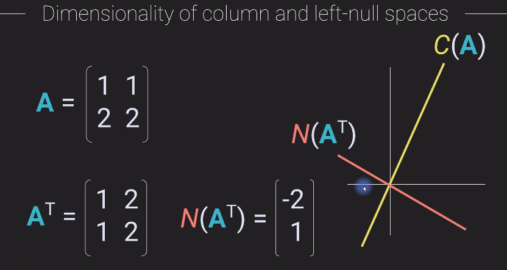
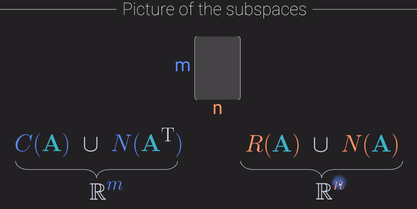

# Matrix Spaces

Definition of Column space

Formal Definition:

Examples:
Is the vector in the column space of A ?
1. Yes

2. Yes 

3. No 

This can be seen geometrically. The the vector in question(orange) is not in the same plane as A

---

When we answer the question if a vector belongs to the column space?
There are 2 answers: 
1. Yes , then what are the co-efficients ?
2. No, then how close is this vector to C(A)

Examples:
1. when the vector is in the column space

This can be re represented as :

2. When the vector in not in the space.
How can we represent it ?

This can be re represented as :

---
# Row space of a matrix

Notation: 

How the matrix multiplication changes , in the sense where we put the weighted vectors.

Application:
Readings from a sensor

---

# Null space of a matrix

Null space is a vector that when multiplied with a matrix results in zero vector

Definition of a null space vector:

There can be number of null space vectors for given matrix.
In the above example , [1,-1]' is one of the null space , [2,-2]' or [x,-x] also is a null space vector. This can be represented as below:

## Relation to independence

A Matrix which has a null space indicates that it is linearly dependent matrix.

Whereas, a matrix without a null space is a linearly independent matrix. 

## Left null space of a matrix 

This is nothings but a row null space.

Definition:

## Null space : Geometric interpretation

1. If the vector is not in the null space we get, multiplying this vector with a matrix will just give another vector (scaled and rotated).
2. If the vector is in the null space we always get a vector at the null point (origin)

---

## Column and row null spaces are orthogonal

dot product of vectors = 0 ==? They are orthogonal
There is no projection of one vector onto the other vector. They have absolutely nothing in common. 

This is nothing but the definition of left null space.

Example:

1. here in the below example it can be seen that the null space is orthogonal to all the columns of the vector A.

2. On the other hand for the below example there is no one line that can be perpendicular to 2 other lines shown in the image

## row null space

Similarly as above

## Dimensions of column/row/null spaces

Dimentionality and the rank of the matrix are not the same.

Example: 

1. Here is a 3X3 full rank matrix, so the rank is 3 but the null space is empty as is the left null space and so the dimensionality of the null space is zero.

    While the dimensionality of the column space is 3. 

2. 

3. 

4.

## Summary 

The dimensionality of the column space plus the dimensionality of the left null space must equal to M of mxn matrix.

Similarly for the row space it must be N

---
# Example of the four subspaces

Example:

For this matrix, following are the sub spaces:

1. Column Space:  

    The ambient dimensionality is just the number of elements in the column. i.e 2, hence R2

    So since we are working in 2 dimensionality, we can now from the matrix A find the column space as below.

    

    We can also write this as 

    

2. Row Space

    And now to figure out a basis set for the row space we just need to determine whether these two rows form a linearly independent set or a linearly dependent set.And in fact we already know the answer from the column space because from the column space we can see
    that the rank of this matrix is 2. So therefore these two rows must form a linearly independent set.

    The dimensionality of the row space is also two because we have two vectors in the basis.

    So the dimensionality is the same as the column space but the key difference is that the column space is a plane that spans all of R2 whereas the row space is a plane that is some subspace of R3.

    

3. left-null space / Column space 

    We know that the columns space and the left null space are orthogonal sub spaces and together they produce all of, or they span, all of R^M, which in this case is R2 and we already have dimensionality of two for the column space.

    So therefore the left null space is the empty set which has dimensionality zero and now it's basically the same story for the null space.

    

4. row/null space

     We know that, here it has to be dimensionality one because two plus whatever this dimensionality is needs to equal three. (Summary last section)

     Now we need to find the vector.

    

---

## Ax = b

Is there a solution to this equation?
Therer is a solution if b belongs to the Column space of A

Now if there is no solution -- no exact solution to this equation then that means that B is not in the
column space of A. And that leads to the second question which is what is another vector. 
b-hat 

It's not exactly b but it's chosen such that it actually is in the column space of Matrix A, meaning
that this still is a valid solution.

And from here you want to know how good this solution is meaning how different is B hat from the original B that can be formulated like this is a B hat minus B and then the magnitude of that difference vector,
and the idea is that the best solution to this problem is the solution that minimizes this difference or minimizes the magnitude of this difference vector.
This is called the least squares solution.

---
## Ax = 0

This is not but finding the null space of the matrix.

