# Systems of equations

## Geometric perspective

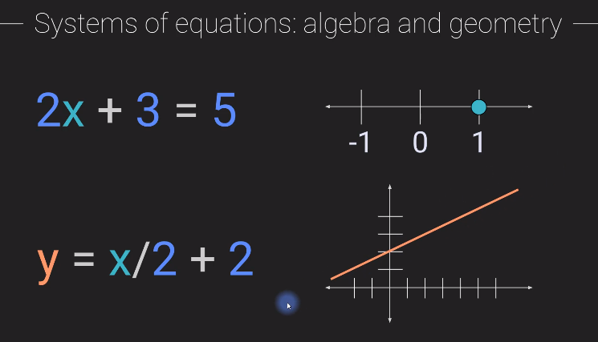

Solution of two equations in this case is the point of intersection of the two lines

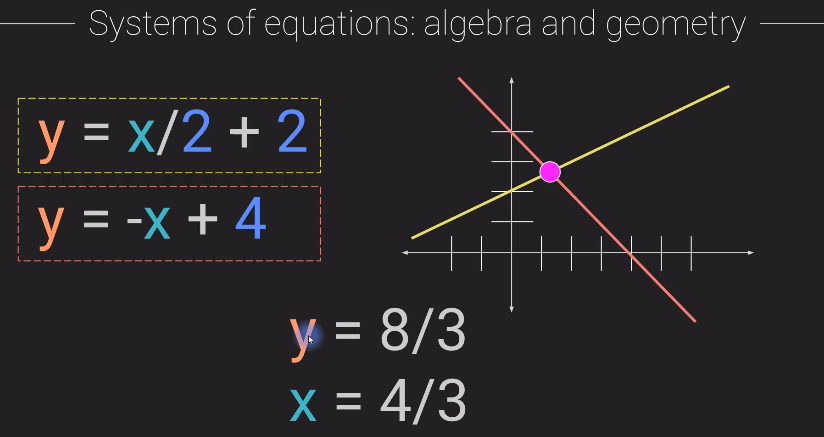

In a system of couples equation, when we add or subtract equations the solution will not change.

for example:

(equation 1) - (equation 2) = (new equation 1)

(equation 2) + 2*(equation 1)=  (new equation 2)

Though we have new equation, the solution of the new equations are still the same as seen below.

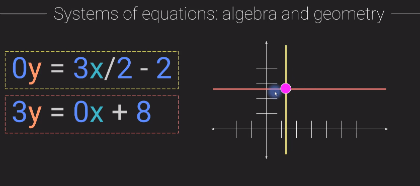

## Converting system of equations to matrix equations

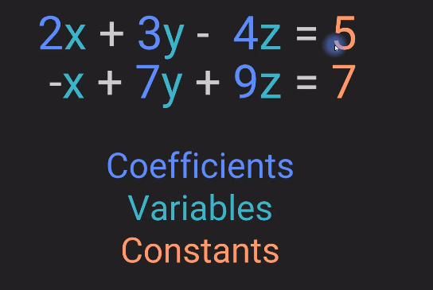

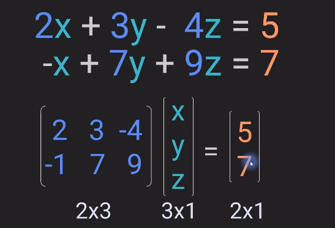

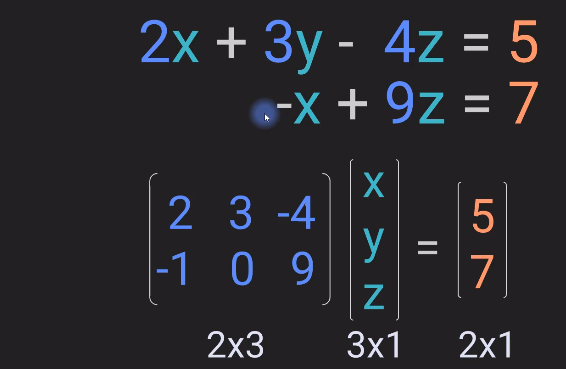

## Guassian elimination method of solving equations

Steps in guassian elimination method:

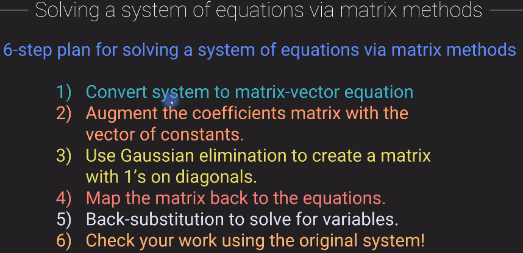

Example: 

Step1: 

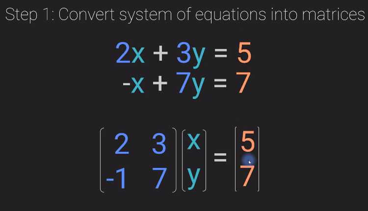

Step2:

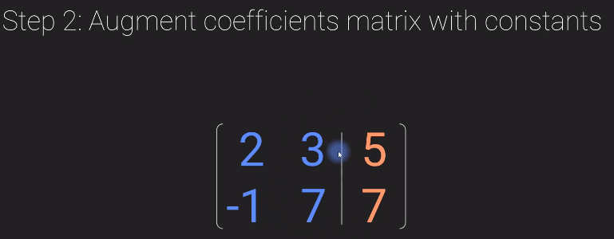

Step3:

This is also known as Echelon form of a matrix

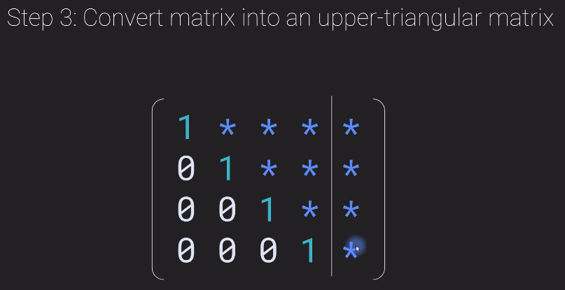

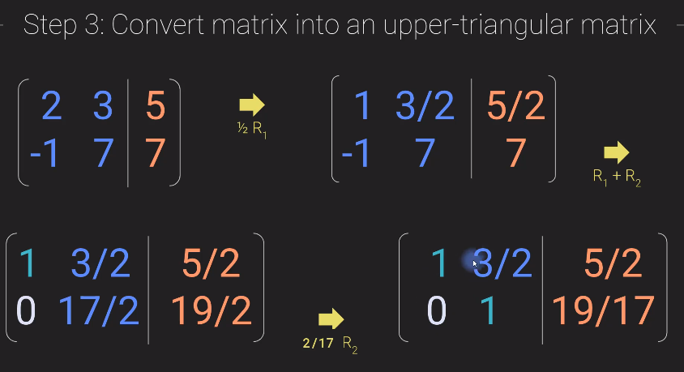

Step4:

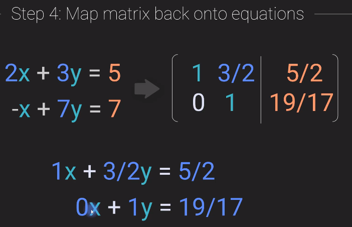

here we have already solved for y. y =19/17

Step5:

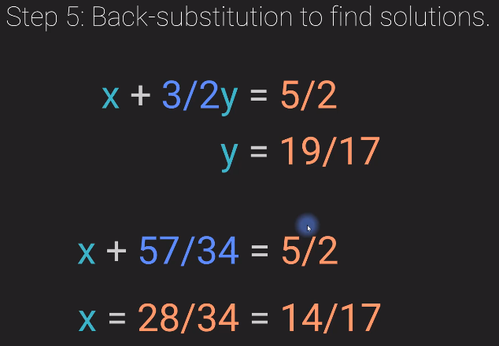

Step6:

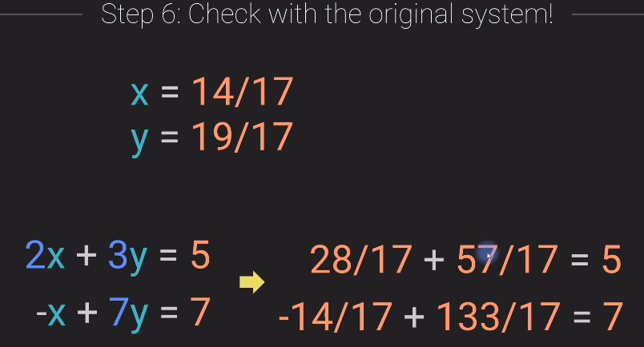

## Other possibilities

### 0 = 0

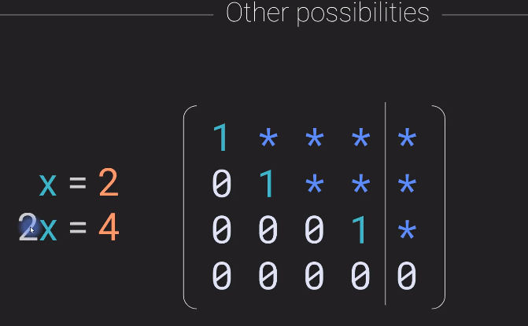

We might work through a problem and end up with a form that looks like this after Gaussian elimination where we get an entire row of zeros at the bottom.

This basically means that the last equation completely dropped out and we end up with zero equals zero. Now when this happens it means that one at least one row in the matrix is a multiple of at least one other row.

In other words the system and the matrix that represents that system is reduced rank or rank deficient.

### 0 = 1

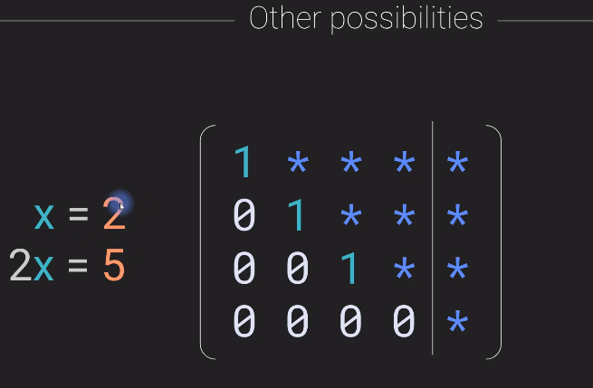

Now this is not a valid mathematical statement at least not in our universe that we are living in; zero does not equal 1 and zero cannot equal anything other than zero.

So the conclusion if we end up with something like this the conclusion is that the system of equations is inconsistent. It does not have a single solution.Now geometrically this would mean that the lines described by these equations never meet at a single point.

There is no one point where all of these lines are touching each other.

---
# Echelon form and pivots

The most noticeable feature of the Echelon form  is that there are zeros below and to the left of the Matrix the leading nonzero terms in the each row are called **pivots**.

In the below image a,f and j are pivots.

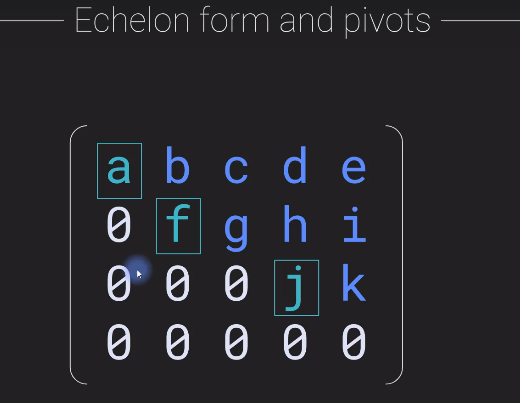

The ones in the below image are not in echelon form and hence they are not pivots. We can ge to echelon form here my moving some rows.

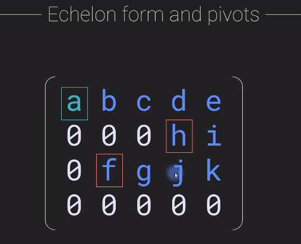

## Converting to echelon form : example

- Usually it's useful to use the first row as best as possible use the first row to knock out subsequent rows because we want the first row to have its pivot value here in the leftmost position of the first column.

- The second tip is it's generally useful to try to eliminate the bottom row first so apply elimination first to the bottom row and then work your way up so that we get zeros below the first pivot and then we keep working down from the second pivot. The third pivot and so on.

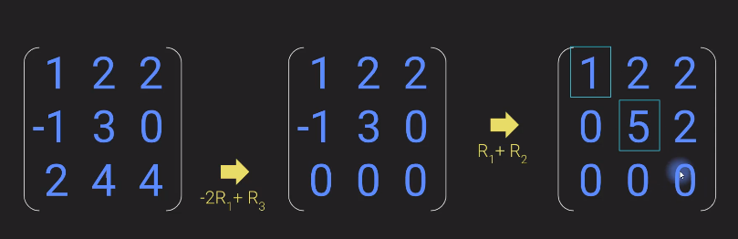

here we get 2 pivots : 1 and 5. 
As there are 2 pivots, the rank of this matrix is 2.

>  The number of pivots is equal to the rank of that matrix.

---

## Reduced row echelon form(RREF)

RREF is similar to the Echelon form in the sense that the pivots have all zeros below them and to the left of them, but with RREF, **there needs to be all zeros above the pivot's and all the pivots need to have a value of one**.

Examples:

1. This is in the echelon form as it satisfied the conditions mentioned above 

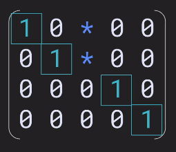

2. Not in echelon form

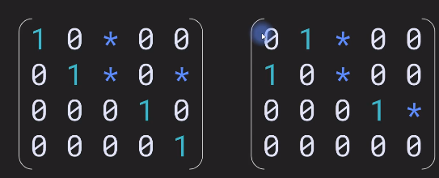

3. Not in echelon form

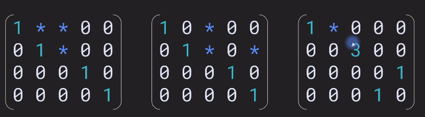

## Conversion example
1. 
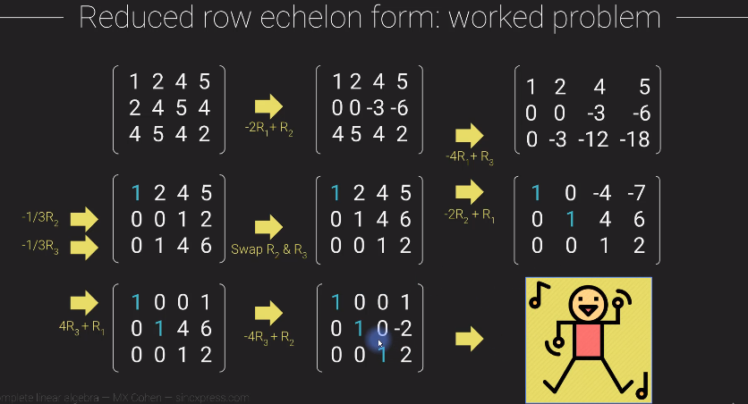

2. 
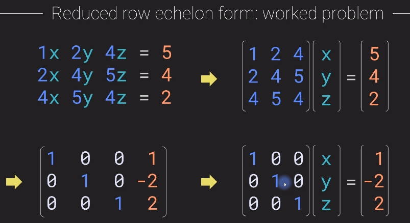

---
##  Row space after row reduction

Rank and row space doesnot change

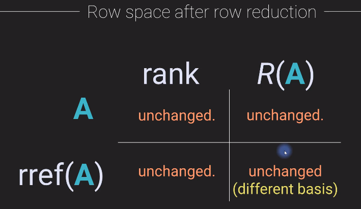

##  Column space after row reduction

After row reduction column space might change not necessarily.

Example where this changes:

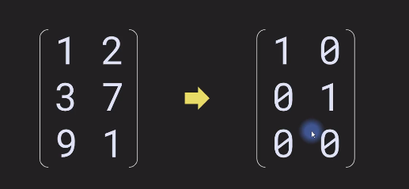

Example where this does not change:

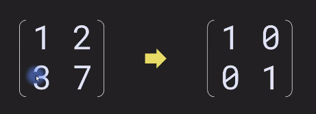