# Matrix Determinant

## Characteristics 

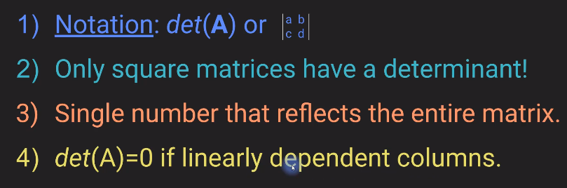

## Application of Determinant

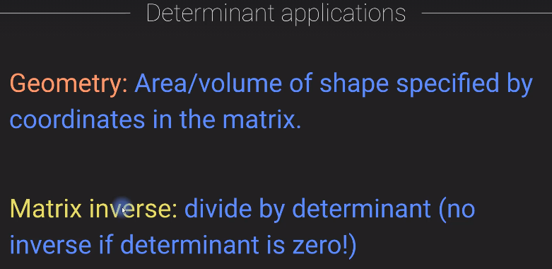

## Determinant of a 2x2 matric

Examples:

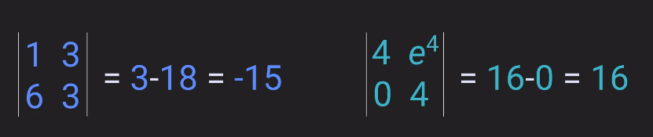

Determinant of a linearly dependent colums = 0

## Determinant of 3x3 matrix

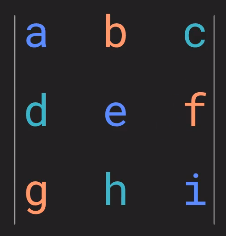

Trick1:

- augment the matrix with itself. 
- Make the right diagonals as seen below, multiply and add those
- Make the left diagonals as seen below, multiply and add those
- Determinant = right component - left component

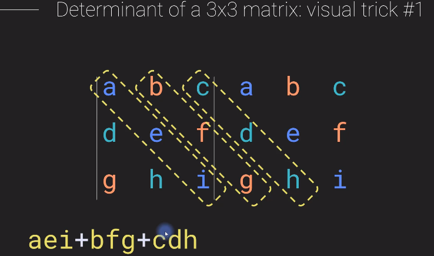

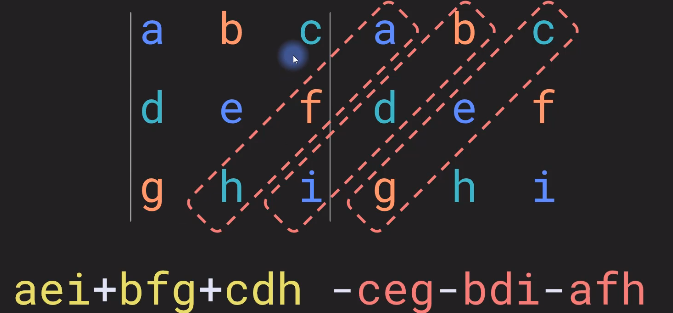

Determinant  = (aei+bgf+cdh) - (ceg+bdi+afh)

Trick 2 

- make the right diagnonal, and multiply (aei)
- make a next make a smaller diagonal of 2 elements on the lower side of the matrix and multiply it with top right element of upper side i.e (dhc)
- make a next make a smaller diagonal of 2 elements on the upper side of the matrix and multiply it with bottom left element of lower side i.e (bfg)
- Add the three elements (aei+bgf+cdh)

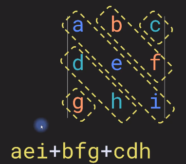

Repeat the above steps by making a left diagonal, 
we get (ceg+bdi+afh)

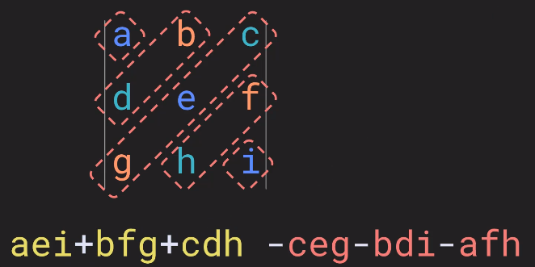

Determinant  = (aei+bgf+cdh) - (ceg+bdi+afh)

Example: 

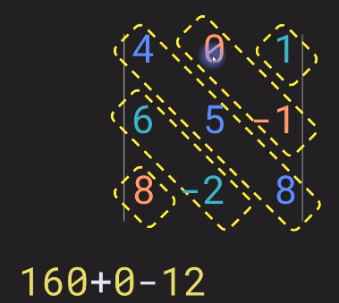

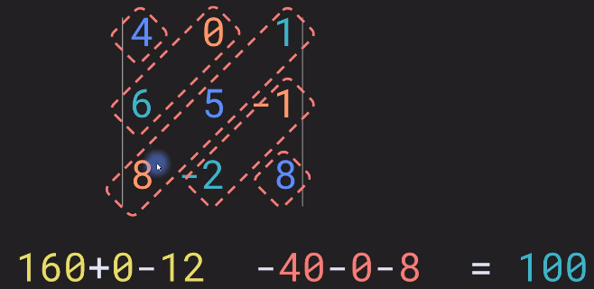

## Determinant of a 3x3 rank-deficient matrix

It is zero 

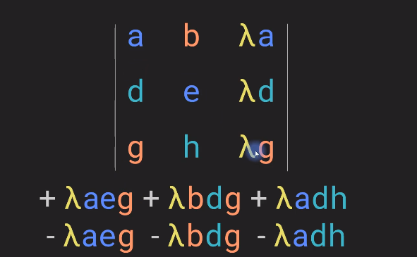

## Common properties : 

1. The determinant of a identity matrix is always 1.

2. Determinant of a row exchanged Matrix is negative of the original determinant of the matrix.

## Finding an unkown given a determinant

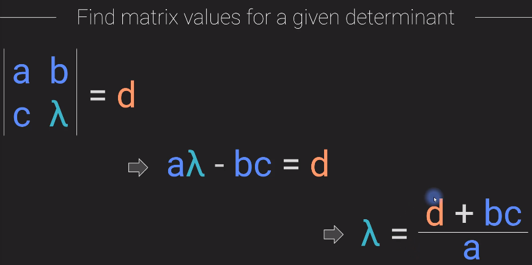

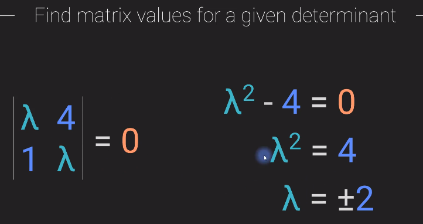

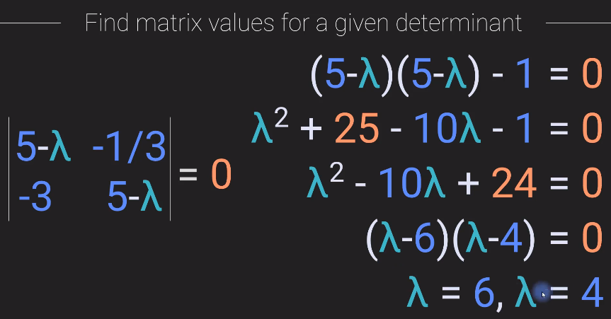