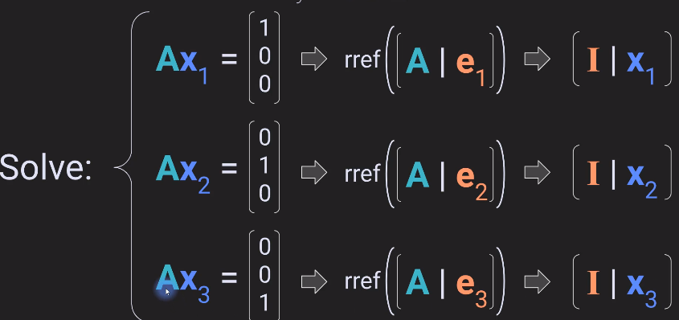

# Matrix Inverse

In linear algebra, an n-by-n square matrix $A$ is called invertible (also nonsingular or nondegenerate), if there exists an n-by-n square matrix $B$ such that

$AB=BA=I_n$

where $I_n$ denotes the n-by-n identity matrix 

## Why a matrix inverse is necessary

In $Ax=b$ to solve for $x$ we need to compute the inverse of $A$ (  $A^{-1}$)

Examples of applying inverses on both sides of an equation 

All matrices do not have an inverse.

**Conditions for having an Matrix inverse :**

- Matrix must be Square 
- It must be a Full rank matrix

## Inverse of 2x2 Matrix

Following are the steps to compute the Inverse of matrix

It is always recommendable to check if the matrix' determinant is not zero become computing the inverse.

Final step is to verify that the computed inverse is actually the inverse: 

Example:

---
# MCA algorithm to compute the inverse of the matrix

Steps involced in MCA algorithm 

Step M : 
Compute the minor matrix.
A minor matrix is a matrix of determinants.
to compute $a_{ij}$ element of a minor matrix, one needs to ignore the i-th row and j-th column of the matrix and compute the determinant of the remainig elements as shown in the below examples.

To compute the $a_{11}$ element of the matrix, ignore row-1 and column-1 and compute the determinant of the remaining elements

 To compute: $a_{12}$ ignore row-1 and column-2

 To compute: $a_{33}$ ignore row-3 and column-3

and so on..

Step C: The co-factors matrix

The cojugate matrix can be seen as a +/- checkerboard multiplied by the Minors matrix

Step A: The Adjugate Matrix

To create the adjugate matrix one must transpose the co-factor matrix and divide each element by the determinant of the matrix

Example: 

---
## Computing inverse via reduced row echelon form(RREF)

Example: 

Inverse of a singular matrix: 

Here we can see we do not get the Identity matrix as in the above case.
Hence this matrix do not have an inverse.

## Why RREF inverse works 

We Solving system of equations, gives are us the solution here lets say $x_1$, $x_2$, $x_3$

Solving it step by step we see that we get $AX = I$ which is nothing but $X =A^{-1}$

## Left and right inverses 

Technically square matrices can habe the full inverse but certain rectangular matrices can have what's called a one sided inverse.

A one sided inverse is a matrix that can multiply another matrix to produce the identity matrix but only when it multiplies the Matrix on one side. So that's why it's called a left inverse if it multiplies on the left and a right inverse if it multiplies on the right.

### Left inverse of tall matrices

Does a wide matrix have a left inverse? 

Wide matrix such as above does not have a left inverse becaue the $A^TA$ is of size nxn and the rank of the matrix A is m which is greater than n. Hence it cannot have a left inverse. However, it can have a right inverse.

### Right inverse of wide matrices

Here we can see that the right inverse is possible for a wide matrix

Right inverse condition for validity

## Proof: Inverse is unique

---

## Pseudo inverse 

The pseudo inverse is denoted as :

Here is an example of pseudo inverse 
$AA^{*}$ is not an identity matrix but looks similar to one.

The above image represented as an image.

Other propoerties of pseudo inverse: 

