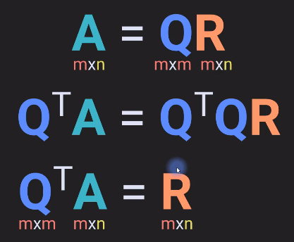

# Projections and Orthogonality

## Projections in $R^2$

Projecting a point on to the line.

i.e Projection is defined as: 

beta = mapping/magnitude

## Projections in $R^N$

Extending the above forumla from $R^2$ to $R^N$

Considering the system of equations: $Ax=b$

Here we can see that $x$ is similar to $\beta$

If A is already a Full-rank matrix, then X solves to the following

This equation can also be represented as:

---
## Orthogonal and parallel vector components

Decompose a single vector w in to a orthgonal(w$_{\perp v}$) and parallel(w$_{||v}$) vector to a reference vector v. 

Parallel component w.r.t reference vector V (w$_{||v}$)

Perpendicular component w.r.t reference vector V (w$_{\perp v}$)

This can be obtained by subracting parallel compoenent from w.

### Proof : Perpendicular and Parallel components of w are orthogonal

We know that the dot product of 2 vectors is zero when they are orthogonal.

Applying the same here:

Example: 

Here we are swapping the letters w and v from as used above.

Geometrically 

---
## Orthogonal Matrices

Properties: 

Formal definition

This is nothing but, $Q^TQ=I$

Example : 

for $\theta = \Pi/4$ : Roational matrix

In 3D :

### Rectangular Q matrix

Here we can see that it is a one sided inverse matrix as $Q^TQ=I$ and $QQ^T\not = I$

---

## Gram-Schmidt procedure to create orthogonal matrix

- 1st column is same as the initial reference matrix
- 2nsd column is the orthogonal vector of the initial 2nd column w.r.t 1st column of the resulting vector
- 3rd column is the orthogonal vector of the initial 3rd column w.r.t 1st column and the 2nd column of the resulting vector
- Similarly for column 4
- Then normalize to get the orthogonal matrix

Example: 

First column of the resulting vector is same as the initla column 1. To make it a unit vector we need to normalize i.e divide by magnitude ($\sqrt{1^2+3^2}= \sqrt{10}$)

2nd column of the orthogonal matrix is obtained by subracting the original column2 with the parallel component of column-2 w.r.t coloumn-1

Similarly for column 3

All the math results to a  [0 0] vector. This should not come as a surprise because the vector that can be parallel to ${a_1}^*$ and ${a_2}^*$ could only be a zero vector.

Geometrically 

green arrow --> has just become a unit vector
orange arrow --> now orthogonal to green and unit vector
yellow arrow --> at the origin

Resulting matrix :

The orthogonal matrix has lost information. i.e, we cannot create the original matrix back form $A^*$. 

We can use the QR method where Q is the orthogonal matrix and R another matrix, together we can get back the original matrix.

---

## QR decomposition

With this we can obtain the original matrix A. 

R--> Recidual matrix

